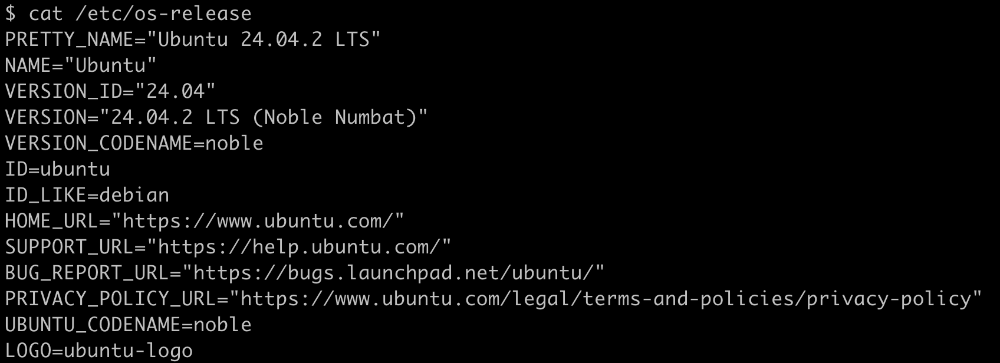
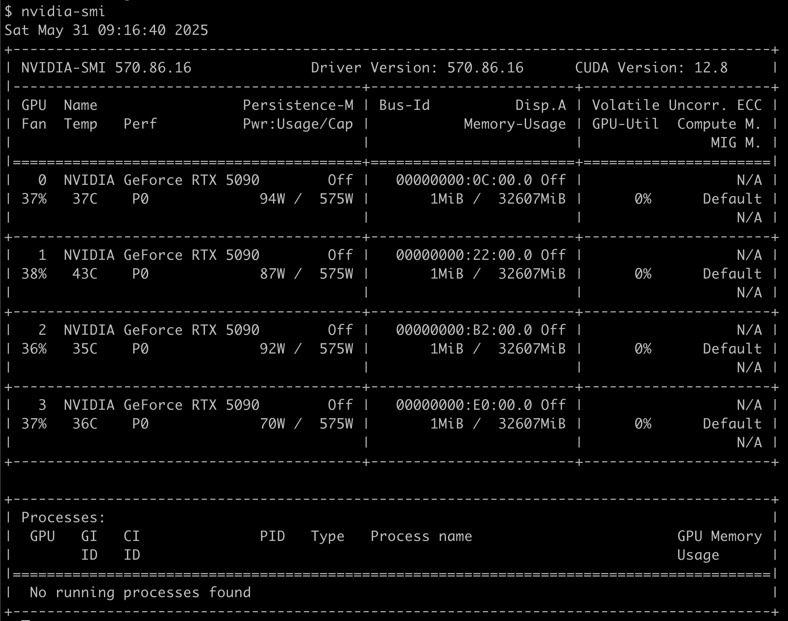
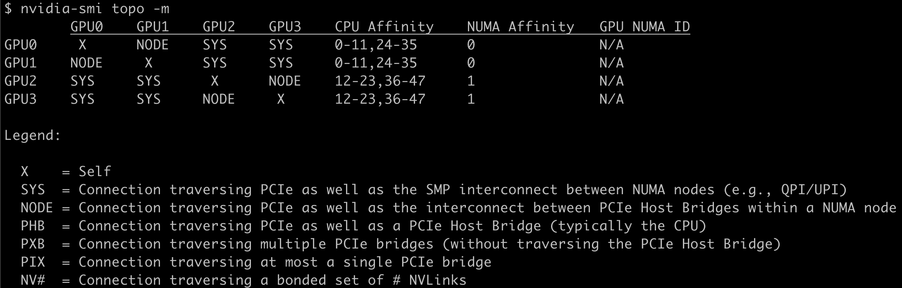

This project is from [nvbandwidth](https://github.com/NVIDIA/nvbandwidth), the official tool provided by NVIDIA for measuring the bandwidth of NVIDIA GPUs. I measured the bandwidth of a server with four GeForce RTX 5090 via the original test script it provided. In addition, I wrote test scripts `mem_read_bw.cu` and `mem_write_bw.cu` for measuring the true video memory bandwidth of the GPU.

# OS & GPU Info

**Operating System**



**GPU**



**GPU topology**




# Dependencies

```bash
sudo apt install libboost-program-options-dev
sudo apt install -y build-essential

# Check the version of cmake, it must be greater than 3.20.0
cmake --version		# cmake version 4.0.2

# install nvcc
wget https://developer.download.nvidia.com/compute/cuda/repos/ubuntu2404/x86_64/cuda-ubuntu2404.pin
sudo mv cuda-ubuntu2404.pin /etc/apt/preferences.d/cuda-repository-pin-600
sudo apt-key adv --fetch-keys https://developer.download.nvidia.com/compute/cuda/repos/ubuntu2404/x86_64/3bf863cc.pub
sudo add-apt-repository "deb https://developer.download.nvidia.com/compute/cuda/repos/ubuntu2404/x86_64/ /"
sudo apt update
sudo apt install cuda-toolkit-12-8
export PATH=/usr/local/cuda-12.8/bin:$PATH
export LD_LIBRARY_PATH=/usr/local/cuda-12.8/lib64:$LD_LIBRARY_PATH

nvcc --version
# nvcc: NVIDIA (R) Cuda compiler driver
# Copyright (c) 2005-2025 NVIDIA Corporation
# Built on Fri_Feb_21_20:23:50_PST_2025
# Cuda compilation tools, release 12.8, V12.8.93
# Build cuda_12.8.r12.8/compiler.35583870_0


cd nvbandwidth
cmake .
make -j$(nproc)
```

# How to run

```bash
# This command will execute nvbandwidth's all default test scripts and log them to result.json
./nvbandwidth --json > result.json

# All built-in test scripts can be viewed using this command.
./nvbandwidth --list

# You can also run just one of the test scripts in the list.
./nvbandwidth --testcase host_to_device_memcpy_ce
```

# About my result.json

1. The bidirectional host-to-GPU bandwidth looks pretty low. Theoretically bidirectional doesn't interfere and should be nearly twice as much as both unidirectional.
   - I think it's due to the nvbandwidth test script.
   - The `host_to_device_bidirectional_memcpy_ce` is running a host → device copy, while a device → host copy is running in the background. What is measured is the host → device bandwidth and the device → host direction is also running (but not measured). `device_to_host_bidirectional_memcpy_ce` is the opposite.
   - **So the true total bandwidth in both directions should be the sum of these two test results.**
   - You can find the source logic for the test script in `nvbandwidth/testcases_ce.cpp`
     -  `void HostToDeviceBidirCE::run(unsigned long long size, unsigned long long loopCount) {...}`
   - While this explanation is relatively reasonable, the two traffics also appear to be interfering with each other, but not to the extent of unidirectional transmission. The 5090 topology given above is common. Therefore, the interference is understandable and the two GPUs will share the PCIe switch.

2. NVIDIA's official 5090 memory bandwidth should be 1.8 TB/s, why is the result in result.json only 700+ GB/s?
   - Here I give two test scripts `nvbandwidth/mem_read_bw.cu` and `nvbandwidth/mem_write_bw.cu` that I wrote to measure the real read bandwidth and write bandwidth.
   - Through the test results, I feel that the write bandwidth is closer to NVIDIA's official theoretical peak of 1.8 TB/s, and the read bandwidth is almost still a little far away.

